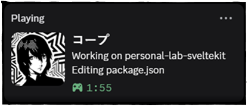

Dly's Extension RPC

A Confidant-themed Discord Rich Presence for Visual Studio Code

Show what you are working on through a customizable Discord activity, complete with project-aware Confidant-inspired artwork.

About

Dly's Extension RPC is a customizable Discord Rich Presence extension for Visual Studio Code. It displays the current workspace, active file, programming language, elapsed session time, and a stable project-specific image on your Discord profile.

Each project is assigned one of 23 Rich Presence images using a deterministic project identity. Opening the same project again keeps the same image instead of choosing one randomly.

This is an unofficial, fan-made project inspired by the visual style of the Persona series.

Preview

  

Add your Rich Presence screenshot as images/preview.png to display it above.

Features

Confidant-themed Discord Rich Presence

23 custom project images (rpc_1 through rpc_23)

Stable automatic image assignment for every project

Git remote-based project identification

Workspace path fallback for local projects

Per-workspace image override

Active workspace, file, and language detection

Customizable activity text using template variables

Optional elapsed session timer

Playing, Listening, Watching, and Competing activity types

Automatic reconnection when Discord restarts

Multi-root workspace support

Status bar indicator and control menu

Requirements

Visual Studio Code

Discord Desktop running on the same computer

Activity sharing enabled in Discord

Discord in a web browser cannot receive local Rich Presence connections.

Installation

Install from a VSIX package

Download the latest .vsix file from the repository releases.

Open Visual Studio Code.

Open the Command Palette with Ctrl+Shift+P.

Run Extensions: Install from VSIX....

Select the downloaded .vsix file.

Reload Visual Studio Code when prompted.

You can also install it from a terminal:

code --install-extension extension-rpc-0.2.0.vsix

Run from source

git clone YOUR_REPOSITORY_URL
cd extension-rpc
npm install
npm run compile

Open the project in Visual Studio Code and press F5 to start an Extension Development Host.

Commands

Open the Command Palette with Ctrl+Shift+P and search for Extension RPC.

Command

Description

Extension RPC: Open Control Menu

Opens the main Rich Presence controls.

Extension RPC: Toggle Rich Presence

Enables or disables the presence.

Extension RPC: Select Project Icon

Uses automatic mapping or selects an image manually.

Extension RPC: Reconnect to Discord

Restarts the local Discord RPC connection.

Extension RPC: Open Settings

Opens all extension settings.

Settings

Setting

Default

Description

extensionRpc.enabled

true

Enables or disables Discord Rich Presence.

extensionRpc.detailsFormat

Working on {project}

Controls the primary presence text.

extensionRpc.stateFormat

Editing {file}

Controls the secondary presence text.

extensionRpc.largeImageTextFormat

{project} • {language}

Controls the large-image tooltip.

extensionRpc.showElapsedTime

true

Shows or hides the current session timer.

extensionRpc.iconOverride

0

Selects image 1–23; 0 uses automatic mapping.

extensionRpc.activityType

playing

Selects Playing, Listening, Watching, or Competing.

Workspace-specific settings are stored in the current workspace when a project is open. This makes it possible for different projects to use different image overrides.

Template Variables

The text settings support the following variables:

Variable

Value

{project}

Current workspace name

{file}

Active file name

{language}

Active Visual Studio Code language ID

{icon}

Selected Rich Presence asset key

Example configuration:

{
  "extensionRpc.detailsFormat": "Working on {project}",
  "extensionRpc.stateFormat": "Editing {file} • {language}",
  "extensionRpc.largeImageTextFormat": "{project} • {icon}"
}

Activity Types

The activity type can be changed from the extension settings.

Setting value

Discord display

playing

Playing

listening

Listening to

watching

Watching

competing

Competing in

Playing is used by default.

Project Image Mapping

Automatic mapping is deterministic rather than random:

The extension checks the active workspace.

If the workspace has a Git remote, the normalized remote URL becomes its identity.

Otherwise, the normalized workspace URI is used.

The identity is hashed and mapped to one of the 23 Discord assets.

As long as the project identity and the number of available assets remain unchanged, the same project receives the same image whenever it is opened.

To override the automatic selection for one workspace, run Extension RPC: Select Project Icon and choose rpc_1 through rpc_23.

Building a VSIX

Compile and package the extension with:

npm run compile
npx vsce package

The generated .vsix file can then be installed manually or attached to a GitHub release.

Troubleshooting

Rich Presence does not appear

Make sure Discord Desktop is running.

Enable activity sharing in Discord settings.

Run Extension RPC: Reconnect to Discord.

Restart Discord and reload the Visual Studio Code window.

Make sure another application is not interfering with Discord RPC.

The project image looks outdated

Discord may temporarily cache Rich Presence assets. Restart Discord after replacing assets in the Developer Portal. Asset keys should remain named rpc_1 through rpc_23.

The extension is connected but shows no project

Open a folder or workspace in Visual Studio Code. When no workspace is open, the extension uses a fallback presence.

Privacy

The Rich Presence connection is made locally between Visual Studio Code and Discord Desktop. The extension reads editor and workspace information only to construct the activity shown on Discord.

Credits and Disclaimer

This is an unofficial, fan-made project created for personal and educational purposes.

Persona and all related characters, names, artwork, trademarks, and visual assets belong to their respective owners, including ATLUS, P-Studio, and SEGA.

This project is not affiliated with, endorsed by, sponsored by, or officially connected to ATLUS, P-Studio, or SEGA. No ownership is claimed over Persona-related material.

Attribution does not grant a license to redistribute third-party artwork. Contributors and users are responsible for ensuring they have permission to use any visual assets they add or distribute.

License

The original source code of this project is licensed under the MIT License.

Persona-related artwork, character images, trademarks, and other third-party visual assets are not covered by the MIT License. All rights to those materials remain with their respective copyright holders.

Made for developers who want their coding activity to feel a little more like building a Confidant.

