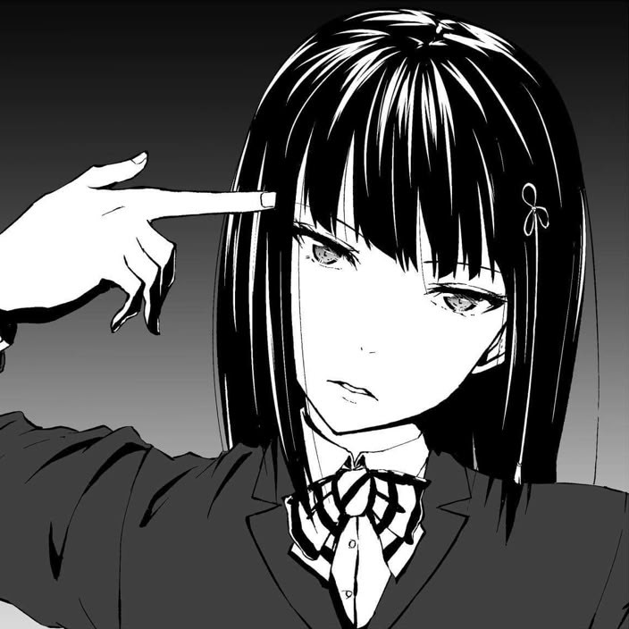

<div align="center">



# Dly's Persona 5 Discord RPC Extension

**Confidant-themed Discord Rich Presence for Visual Studio Code**

Display your active project, file, language, and session time on Discord with a stable project-specific visual.

<br>


</div>

---

## Overview

This Discord RPC Extension connects Visual Studio Code to Discord Desktop through local Rich Presence. It keeps the activity current as you move between files and workspaces, while allowing the displayed text and project visual to be configured.

Every workspace is mapped to one of 23 Confidant-themed of Persona 5 Royal Social Links. The mapping is deterministic rather than random, so reopening the same project produces the same visual.

| Capability | Behavior |
| --- | --- |
| Project identity | Uses the normalized Git remote when available |
| Local fallback | Uses the normalized workspace URI |
| Project visuals | Maps each identity to `rpc_1` through `rpc_23` |
| Editor context | Tracks the active project, file, and language |
| Session context | Optionally displays elapsed session time |
| Connection | Reconnects automatically when Discord becomes available |

## Preview

<div align="center">
  <a href="images/preview.png">
    
  </a>
</div>

## Features

### Presence

- Active workspace, file, and language detection
- Customizable primary text, secondary text, and image tooltip
- Optional elapsed session timer
- Live updates when the active editor or workspace changes

### Project visuals

- 23 Rich Presence Confidant assets
- Stable project-to-image mapping
- Git remote-based project identification
- Workspace URI fallback for local projects
- Per-workspace manual image override

### Reliability and controls

- Automatic reconnection with exponential backoff
- Multi-root workspace support
- Status bar connection indicator
- Quick-access control menu

## Requirements

- Visual Studio Code `1.134.0` or newer
- Discord Desktop running on the same computer
- **Display current activity as a status message** enabled in Discord's Activity Privacy settings

> [!IMPORTANT]
> Discord's web client cannot receive local Rich Presence connections.

## Installation

### Install from VSIX

1. Download or build the `.vsix` package.
2. Open Visual Studio Code.
3. Open the Command Palette with `Ctrl+Shift+P` (`Cmd+Shift+P` on macOS).
4. Run **Extensions: Install from VSIX...**.
5. Select the downloaded package.
6. Reload Visual Studio Code when prompted.

The package can also be installed from a terminal:

```sh
code --install-extension extension-rpc-0.2.0.vsix
```

### Run from source

```sh
git clone https://github.com/RakhaNoor01/extension-discord-rpc.git
cd extension-discord-rpc
npm install
npm run compile
```

Open the project in Visual Studio Code and press `F5` to launch an Extension Development Host.

## Usage

Start Discord Desktop, open a folder or workspace in Visual Studio Code, and allow the extension to connect. The status bar displays the current RPC connection state and opens the control menu when selected.

Use the control menu to toggle Rich Presence, select a project image, reconnect to Discord, or open the extension settings.

## Commands

Open the Command Palette and search for **Extension RPC**.

| Command | Description |
| --- | --- |
| `Extension RPC: Open Control Menu` | Opens the Rich Presence control menu. |
| `Extension RPC: Toggle Rich Presence` | Enables or disables Rich Presence. |
| `Extension RPC: Select Project Icon` | Selects automatic mapping or a specific project image. |
| `Extension RPC: Reconnect to Discord` | Restarts the local RPC connection. |
| `Extension RPC: Open Settings` | Opens the extension settings. |

## Configuration

| Setting | Type | Default | Description |
| --- | --- | --- | --- |
| `extensionRpc.enabled` | boolean | `true` | Enables or disables Rich Presence. |
| `extensionRpc.detailsFormat` | string | `Working on {project}` | Controls the primary activity text. |
| `extensionRpc.stateFormat` | string | `Editing {file}` | Controls the secondary activity text. |
| `extensionRpc.largeImageTextFormat` | string | `{project} • {language}` | Controls the image tooltip. |
| `extensionRpc.showElapsedTime` | boolean | `true` | Shows or hides elapsed session time. |
| `extensionRpc.iconOverride` | integer | `0` | Selects image `1`–`23`; `0` restores automatic mapping. |

Configuration changes made while a workspace is open are stored for that workspace. This allows projects to use separate image overrides and presence formats.

### Template variables

| Variable | Resolves to |
| --- | --- |
| `{project}` | Active workspace folder name |
| `{file}` | Active file name |
| `{language}` | Visual Studio Code language identifier |
| `{icon}` | Selected Discord asset key |

Example:

```json
{
  "extensionRpc.detailsFormat": "Working on {project}",
  "extensionRpc.stateFormat": "Editing {file} • {language}",
  "extensionRpc.largeImageTextFormat": "{project} • {icon}"
}
```

Resolved fields are trimmed and limited to 128 characters. A field shorter than two characters is omitted from the activity.

## Project Image Assignment

Automatic image assignment follows a consistent four-stage process:

1. Determine the active workspace folder.
2. Read and normalize its Git `remote.origin.url`, when available.
3. Fall back to the normalized workspace URI when no remote exists.
4. Hash the resulting identity and map it to `rpc_1` through `rpc_23`.

The assignment remains stable while the project identity and number of available assets remain unchanged.

To pin a different image to a workspace, run **Extension RPC: Select Project Icon** and select an asset. Choose **Automatic** to return to deterministic mapping.

## Building

Install dependencies, compile the TypeScript source, and create a VSIX package:

```sh
npm install
npm run compile
npx vsce package
```

The generated `.vsix` can be installed locally or attached to a GitHub release.

## Troubleshooting

<details>
<summary><strong>Rich Presence is not visible</strong></summary>

1. Confirm that Discord Desktop is running.
2. Confirm that activity sharing is enabled in Discord.
3. Run **Extension RPC: Reconnect to Discord**.
4. Reload Visual Studio Code and restart Discord if necessary.

</details>

<details>
<summary><strong>Discord displays an outdated image</strong></summary>

Discord may cache Rich Presence assets. Restart Discord after replacing an asset in the Developer Portal, and keep its key unchanged.

</details>

<details>
<summary><strong>The RPC connection is unavailable</strong></summary>

The extension retries automatically with a delay of up to 30 seconds. A manual reconnect is also available from the control menu.

</details>

## Privacy

The extension uses Discord's local RPC connection to publish workspace information to Discord Desktop. It reads the active workspace name, file name, language identifier, and Git remote when constructing the activity.

## Credits and Disclaimer

This is an unofficial, fan-made project. It is not affiliated with, endorsed by, sponsored by, or officially connected to ATLUS, P-Studio, or SEGA.

Persona and its related names, characters, artwork, trademarks, and visual materials belong to their respective owners. No ownership is claimed over Persona-related material.

Attribution does not grant permission to redistribute copyrighted assets. Persona-related and other third-party visual assets are not covered by any license applied to the original source code.

## License

No source-code license has been provided for this repository. Unless a license is added, all rights to the original source code remain reserved by default.

Persona-related artwork, character images, trademarks, and other third-party materials remain the property of their respective rights holders.
